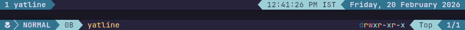

<p align="center">
    
    <h2 align="center">Rosé Pine for Yatline</h2>
</p>

<p align="center">All natural pine, faux fur and a bit of soho vibes for the classy minimalist</p>

## Gallery

### Rosé Pine




### Rosé Pine Moon


### Rosé Pine Dawn


## Installation
```bash
ya pkg add VigneshR387/yatline-rosepine
```

## Usage

1. Add the following line in `init.lua`
```lua
-- Choose the variant you like ("rose_pine" | "moon" | "dawn" )
local rose_pine_theme = require("yatline-rosepine"):setup("dawn")

```
2. Pass the theme to `yatline` setup
```lua
-- init.lua

-- Load the theme inside `require("yatline"):setup`
```lua
require("yatline"):setup({
    theme = rose_pine_theme, -- pass the theme here

    -- Your remaining yatline configuration
    -- header_line = { ... },
    -- status_line = { ... },
})

```


## Thanks to

- [imsi32](https://github.com/imsi32)
- [sxyazi](https://github.com/sxyazi)
- [Rose Pine Theme](https://github.com/rose-pine)


